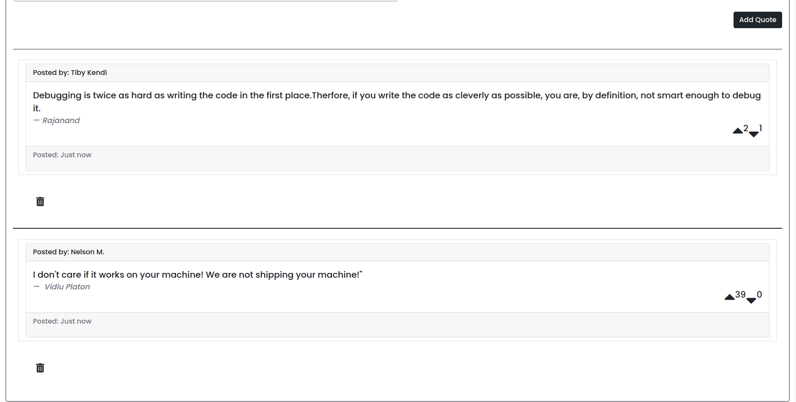

# Application name
Sema-Quotes

# Description
A web-app that allows one to post any type of quote they have in mind. Everybody will be able to view the quotes and decide if it deserves an upvote or a downvote.

# Setup Instructions
You'll be required to enter your quote,the original author of the quote and lastly your name. Add quote to make it viewable by everybody.

## Author and Authors information
Ivy Murithi. I am a student studying software development.

## Technologies Used
1. Angular
2. Bootstrap
3. TypeScript
4. Font Awesome
5. Google Fonts

## Future improvements
Better UI.

## Contacts
[Email](mailto:ivymurithi@gmail.com)